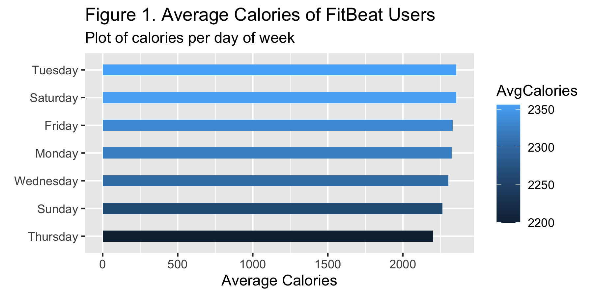
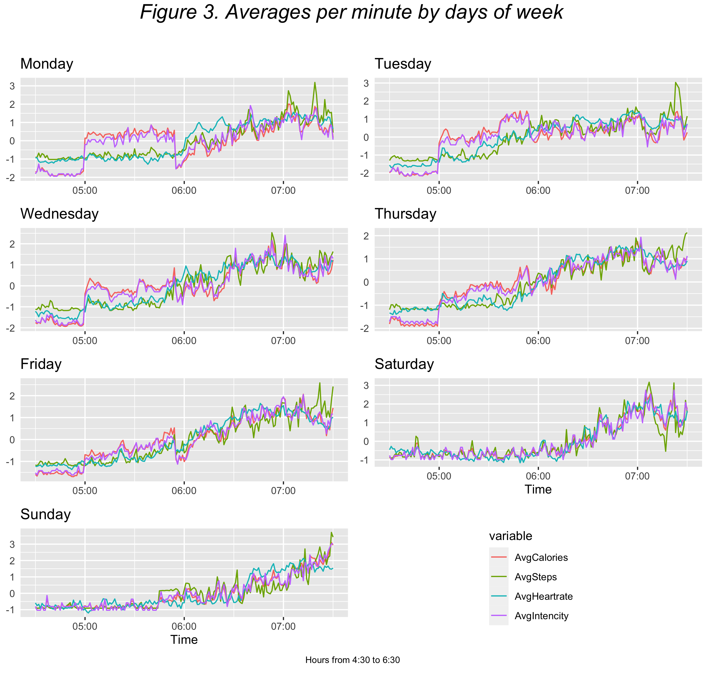
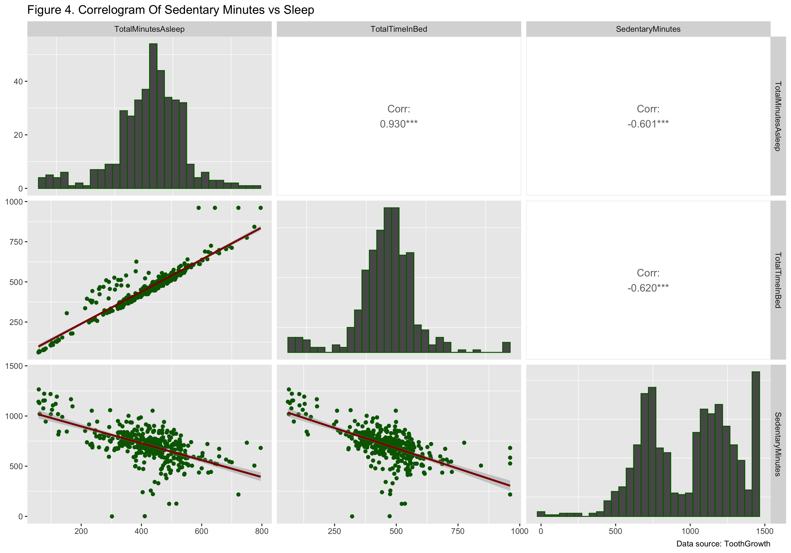
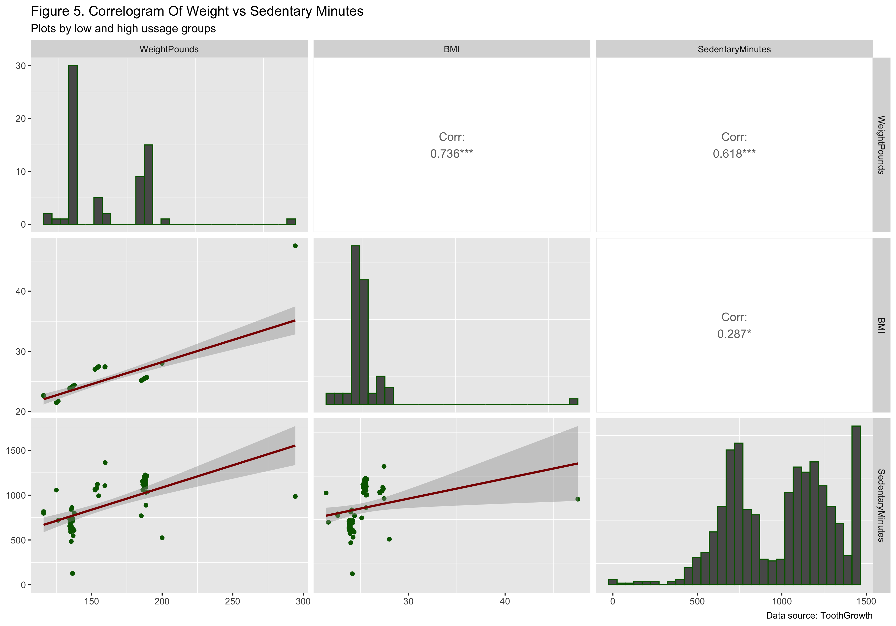
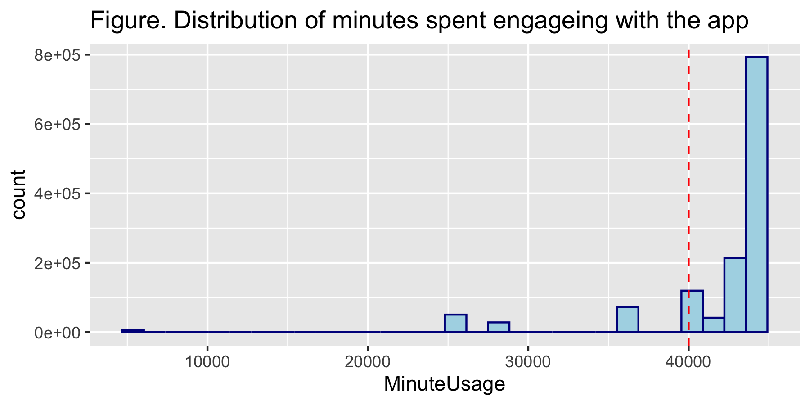
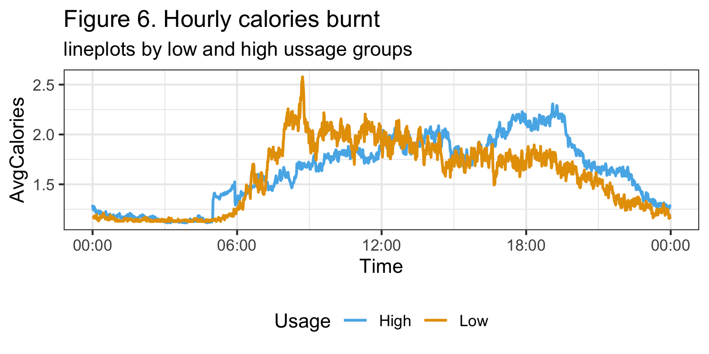
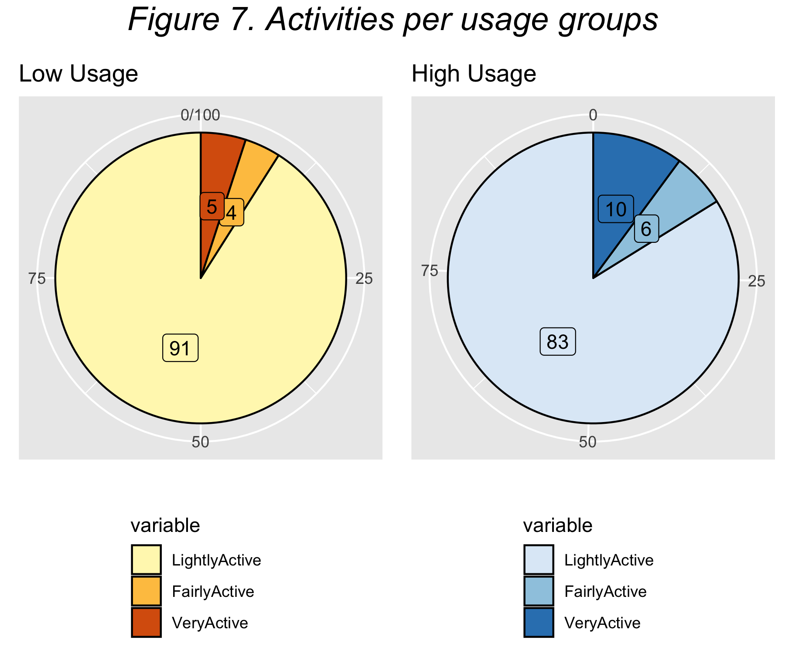
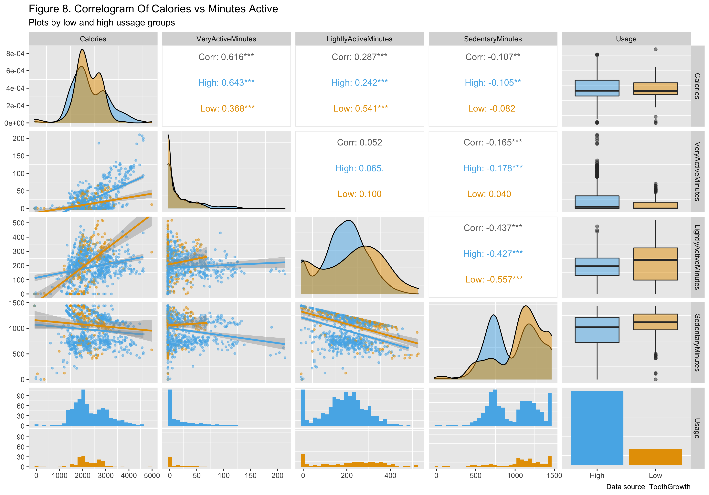
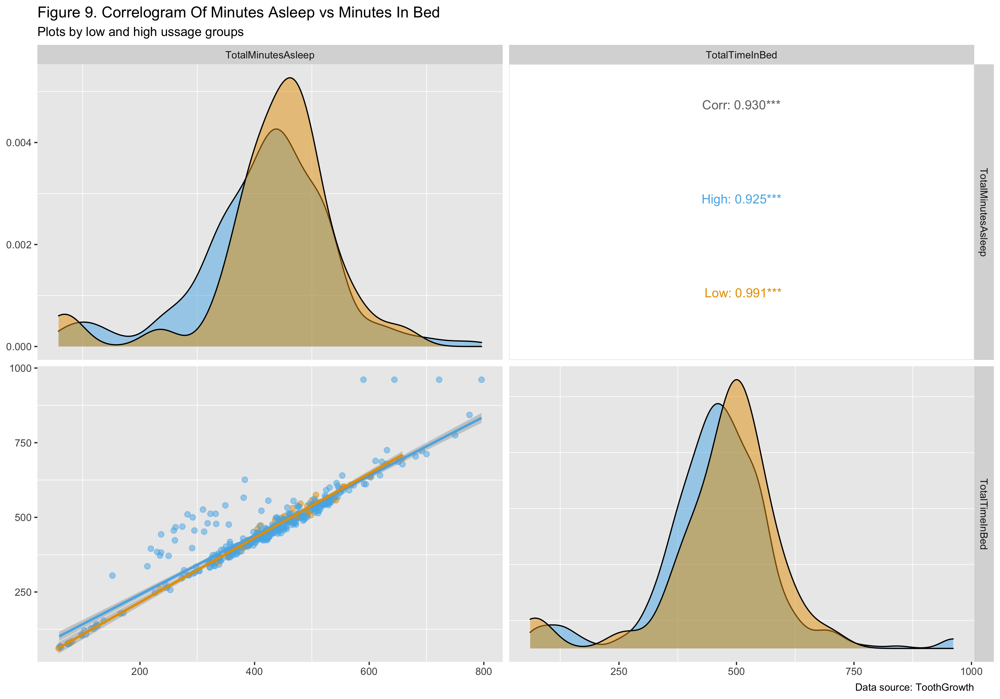

```{r setup, include=FALSE}
knitr::opts_chunk$set(echo = TRUE)
```

```{r, include=FALSE}
## Run sourse code
# source("./r_scripts/clean_data.R", local = knitr::knit_global())
# source("./r_scripts/create_metadata.R", local = knitr::knit_global())
# source("./r_scripts/generate_plots.R", local = knitr::knit_global())
```

# Summary

In this case study I am going to analyze data from FitBit users, which is a personal health tracker. The objective is to gain insights from FitBit secondary data, to drive business decisions for another health tracker company called BellaBeat. This data analysis can help guide BellaBeat's marketing strategies, particularly for two of their products Leaf (tracker bracelet) and Time (wellness watch). Their main feature is tracking and measuring user wellness activities by connecting to BellaBeat app. Then the app provides users with insights into their daily wellness, using attributes such as sleep, weight, calories burnt, menstrual cycle, and mindfulness habits. I am going to analize FitBit data to find the most important problems BellaBeat might face and come up with recommendations on what tools to implement to solve them. The datasets and some instructions were provided by Google Data Analytics, which is a course on Cursera, developed by Google. The datasets are not perfect and have some limitations. The purpose is not to pass over these limitations, and make it seem like the analysis is perfectly accurate, but rather to face the limitations and discuss some possible ways to avoid them in the future. These limitations commonly occur in many similar datasets in practice. Hence, it may be useful to discuss them thoroughly. 

So, the business task is, essentially, to provide BellaBeat with recommendations for their marketing strategy. To reach that goal, the main approach used in the case study is to follow these steps: first to develop a scenario, then understand what the stakeholders would be interested in (deliverable), pre-determine some guiding questions. Then proceed with data analysis process to find answers that lead to the desired recommendations for the marketing team. Here the analysis processes involves the following phases: Data Preparation, Data Cleaning and Processing, Analyze and Visualize. This case study is divided into sections and subsections (refer to the table of content). Following this summary each section can be viewed as one of the data analysis phases (in the same order), which commonly seen in the real world. These phases are sometimes refereed to as ask questions, prepare data, process/clean data, share and act. 

#### Deliverables

1. A clear summary of the business task
2. A description of all data sources used
3. Documentation of any cleaning or manipulation of data
4. A summary of your analysis
5. Supporting visualizations and key findings
6. Your top high-level content recommendations based on your analysis

#### Questions to address

1. What are some trends in smart device usage?
2. How could these trends apply to BellaBeat customers?
3. How could these trends help influence BellaBeat marketing strategy?

# Data Preparation

In this step, we need to prepare data for processing and analyzing. We will need to take a close look at the datasets, summarize them and discover some data quality characteristics. To do so, we need to examine each dataset closely. Originally there where 18 available FitBit datasets that were obtained from Kaggle(XXXX add link). Of the 18 original datasets only 12 were used, since some columns repeated across the datasets and some of them did not fit into the context of this case study problems.

#### Data Summary:

Bellow I created metadata of the datasets that encompasses some of the important data quality characteristics:


```{r, echo = FALSE, warning = FALSE, include=FALSE,  message=FALSE}
# Load Packages and Datasets------------------------------------------

library(dplyr)
library(kableExtra)
library(tidyverse)
library(knitr)
library(reshape2)
library(GGally)
library(grid)
library(gridExtra)
```

```{r, echo = FALSE, warning = FALSE, cache=TRUE}

# read metadata
summaries <- read.table("CaseStudy_data/metadata_orig.txt", header = T) 

# Color the low unique Ids red
summaries$Num.of.Unique.Ids <- cell_spec(
  summaries$Num.of.Unique.Ids, 
  # background = ifelse(summaries$Num.of.Unique.Ids < 33, "red", "white"),
  color = ifelse(summaries$Num.of.Unique.Ids < 33, "red", "black")
  )

# Display the metadata
kbl(summaries, escape = F) %>%
  kable_paper("striped", full_width = F) %>%
  column_spec(1, bold = T, border_right = T) %>%
    column_spec(2, width = "30em") 
```


#### Data Limitations:

There are some limitations found. First and foremost, the datasets have inputs of only 33 unique users. This tells us that the data is not comprehensive. Of the 33 users only 8 entered weight, 12 heart rate and only 24 users for sleep entries. Moreover, within the weight dataset some users did not enter information for all the variables. This means that the data is also incomplete and hence **not comprehensive**. However, since all of these 3 datasets are comprised of important variables, we will still work with those.

The data comes from FitBit users, which is a second source. This tells us the data is **not original**. It means that the data may lead to inaccurate insights, since the user behavior and the data distribution of FitBit is not the same as that of BellaBeat.

Another limitation is that the data is **not current**. The dates at which the data was collected ranges from 4/12/2016 to 5/12/2016, which was about 5 years before the time of this case study.

Another limitation that will most likely affect data integrity is that the data was only collected for only 30 days. So, having only 33 users' data, 30 entries each, will effect the reliability. Moreover we are expecting 30x33=990 rows, however, there are 940 in the daily dataset. This means that some users either did not enter the information, were not wearing the tracker or the device did not collect the data properly. Also some of values were entered manually, for instance, that of the weight information. These and some other complications might resulted in a **biased** data.

Had this been a real-life project that would intend to define BellaBeat's marketing strategy, these limitations would have been addressed before stating the analysis phrase. However, Since this is a case study, and we do not have control over these limitations, we will still proceed to the analysis. Though, we should mention the type of questions that the data analyst would ask in a real world scenario, before proceeding with the data cleaning. Here they are:

- Why some users generated more data rows then others. Is it a device data collection system or did they turn them off ?
- Did users volunteerly contributed data or at their convenience or were they told how often and when to use the app ?
- Is it possible to know what what measures were taken to eliminate the sampling bias ?
- Is it possible to obtain the newer version of these dataets dataset ?
- Is it possible to obtain similar dataset from BellaBeat for originality ?


#### Data Privacy

BealaBeat's website provides a thorough data privacy section. Also comparing with its competitors, it seems to be well developed. Just looking at the first glance it is seems that BellaBeat can collect valuable data from its users and develop marketing strategies based on the data users provide, without revealing their identity or selling to another company. It needs further research to determine the validity of these assumptions. I will leave it to the reader and in the References section provide links that might help. 


# Data Cleaning And Processing

So, we already prepared ground for data processing in the data prep section. Since we decided that we should proceed with the analysis, despite the limitations, we will start the cleaning process. Our focus here should be on discussing data integrity and some risk that may rise if it's violated. One should note that most likely some integrity issues can not be resolved in these case study. This is because we we won't be able to communicate with the stakeholders and request what we need. For instance we found that there were only 8 users who had inputs for weight information. This is a huge problem, since it may lead to wrong conclusions. However, we will determine those issues and ignore them for learning purposes. But keep in mind that in a real-life situation, for a strong analysis, a data analyst would have to do what it takes to ensure data integrity, and only then proceed with the analysis phrase.

Before we do the cleaning, we will take a first look at some of the key datasets and their attributes for illustration purposes. The tables bellow represent the first few observations of the first two users in the dataset. Note that the tables are scrollable, so feel free to explore more rows and columns.


<!-- <div style= "float:right;position: relative; top: +10px; relative; relative; left: +20px"> -->  <!-- display on the right side -->
```{r, echo = FALSE, warning = FALSE, cache=TRUE}

# Table Views ---------------------------------------------------------------------------------

# load some original datasets to display
minuteCalories <- read.csv(paste('./Fitbit_data/', 'minuteCaloriesNarrow_merged.csv', sep = ''))
minuteSleep <- read.csv(paste('./Fitbit_data/', "minuteSleep_merged.csv", sep = ''))
dailyWeight <- read.csv(paste('./Fitbit_data/', 'weightLogInfo_merged.csv', sep = ''))
secondsHeartrate <- read.csv(paste('./Fitbit_data/', "heartrate_seconds_merged.csv", sep = ''))


first_two_ids <- unique(minuteCalories$Id)[c(1,2)] # find first two Ids


# display some original data tables
first_two_ids <- unique(minuteCalories$Id)[c(1,2)] # find first two Ids
table1 <- minuteCalories %>%
  group_by(Id) %>%
  filter(Id %in% first_two_ids, row_number() == c(1:5))  %>%
  kbl(align = "r", caption = '  **Table 1.**    minuteCaloriesNarrow_merged.csv', table.attr = "style='width:30%;'") %>%
  kable_paper("striped", full_width = F)%>%
  scroll_box(width = "400px", height = "200px") 

first_two_ids <- unique(minuteSleep$Id)[c(1,2)] # find first two Ids
table2 <- minuteSleep %>%
  group_by(Id) %>%
  filter(Id %in% first_two_ids, row_number() == c(1:5))  %>%
  kbl(align = "r", caption = '  **Table 2.**   minuteSleep_merged.csv', table.attr = "style='width:30%;'") %>%
  kable_paper("striped", full_width = F) %>%
  scroll_box(width = "400px", height = "200px") 

first_two_ids <- unique(secondsHeartrate$Id)[c(1,2)] # find first two Ids
table3 <- secondsHeartrate %>%
  group_by(Id) %>%
  filter(Id %in% first_two_ids, row_number() == c(1:5))  %>%
  kbl(align = "r", caption = '  **Table 3.**    heartrate_seconds_merged.csv', table.attr = "style='width:30%;'") %>%
  kable_paper("striped", full_width = F) %>%
  scroll_box(width = "400px", height = "200px") 

first_two_ids <- unique(dailyWeight$Id)[c(1,2)] # find first two Ids
table4 <- dailyWeight %>%
  group_by(Id) %>%
  filter(Id %in% first_two_ids) %>% #, row_number() == c(1:2))  %>%
  kbl(align = "r", caption = '  **Table 4.**    weightLogInfo_merged.csv', table.attr = "style='width:30%;'")%>%
  kable_paper("striped", full_width = F) %>%
  scroll_box(width = "400px", height = "200px")

# display the tables
kables(list(table1,table2), caption = "Scrollable tables")
kables(list(table3,table4))

```
<!-- </div> -->
/

In the upcoming paragraphs I will provide a high level description of the steps I took to ensure that the data is clean. Of course, the data cleaning procedure involved a lot of effort and I may not describe some of them here. But it can be found in the scripts and by looking at the comments. So, the data cleaning strategy I used for this case study involves but is not limited to the following steps:

#### Alignment with objectives (merge)

Essential, the purpose of this step is to bring the data into a desired format and align with case study objectives. This includes making necessary transformations and removing the irrelevant information and organizing the datasets in a way that is suitable and makes it easy to analyze. 

**Transformation.** Looking at the 4 datasets above we see that they all have a column **Id**. So, we can use Id to merge the datasets. All the datasets also have a column for date, but some of them have different header names for columns. Thus, we will rename them so we can merge. Also all the datasets include date values like date, hour, minutes and seconds all in that single column. We will split the column for date into **Date** and **Time**, where Date is the date of the observation and Time includes hours, minutes and seconds (whichever ones are available). I also added a column for two usage groups, which will be discussed in the analysis section.

**Dropping columns.** The datasets have columns that provide irrelevant information. Not surprisingly, some of the variables do not fit into the context. Also some of them do not contain invalid information such as LoggedActivitiesDistance, which only has 0s. So we will not keep the irrelevant columns for the analysis. Bellow is the list of some columns that were dropped from the datasets and the reason for doing so:

- Fat: contains all NAs except for two instances. 
- LogId: Do not need for the analysis.
- LogActivitiesDistance: all 0s, hence there is no use in analyzing it.


#### Dealing with outlines

Analyzing the proceeding plots, we may find that there are outlines in the datasets. We need to be careful here: since we don't have enough unique users per dataset, we will not remove them, unless they are too extreme. We will simply consider them as users who either adopted outstanding healthy habits or quite the opposite. 

#### Handling missing data

Since the datasets are not complete, and some users did not contribute data for all the fields, we  will ignore missing values and proceed with the analysis. After all, datasets are not current and there is no way for me to fill the missing values. However we will provide recommendations on how BellaBeat can avoid this type of issues.

#### Removing duplicates 

We will be merging the datasets so that we can analyze daily, hourly and minute data in an appropriate manner. In this step it is expected that duplicate rows will be created when we merge them. We will simply remove the duplicates so that the results are accurate. 

```{r, echo = FALSE, warning = FALSE, cache=TRUE}

# Load Merged Datasets -------------------------------------------------------

daily_data_merged = read.csv2(paste('./CaseStudy_data/', "daily_data_merged.csv",sep = ''))[-1]
hourly_data_merged = read.csv2(paste('./CaseStudy_data/', "hourly_data_merged.csv",sep = ''))[-1]
minute_data_merged1 = read.csv2(paste('./CaseStudy_data/', "minute_data_merged1.csv",sep = ''))[-1]
minute_data_merged2 = read.csv2(paste('./CaseStudy_data/', "minute_data_merged2.csv",sep = ''))[-1]

# join the seperate muinute merged
minute_data_merged <- left_join(minute_data_merged1, minute_data_merged2) 


# display the duplicates
duplicates <- read.table("./CaseStudy_data/duplicates.txt", header = T)
kbl(duplicates)%>%
  kable_styling(bootstrap_options = "striped", font_size = 14)

```

#### Validation

The validation process involves making sure that the merged datasets follow the appropriate formats. This include checking if, for instance, if there were no human errors like entering kg instead of pounds, or if the times are consistent across datasets. Table 2 shows that, even though it is called minute dataset, the time recorded includes second which is 30 for all of them. Hence we will remove the seconds so that we can merge it with other minute based datasets. This will cause inconsistency since the actual sleep times might be 30 minutes off. However we will be analyzing sleep on daily bases rather then hourly, and we will further discuss this inconsistency in the recommendation section. here is the display for final merged datasets that are based on daily, hourly and minute entries:

```{r, echo = FALSE, warning = FALSE, cache=TRUE}

# display teh merged data tables
first_two_ids <- unique(daily_data_merged$Id)[c(1,2)] # find first two Ids
table1 <- daily_data_merged %>%
  group_by(Id) %>%
  filter(Id %in% first_two_ids, row_number() == c(1:4))  %>%
  kbl(align = "r", caption = '  **Table 1.**    daily_data_merged', table.attr = "style='width:30%;'") %>%
  kable_paper("striped", full_width = F)%>%
  scroll_box(width = "800px", height = "200px") 

first_two_ids <- unique(hourly_data_merged$Id)[c(1,2)] # find first two Ids
table2 <- hourly_data_merged %>%
  group_by(Id) %>%
  filter(Id %in% first_two_ids, row_number() == c(1:5))  %>%
  kbl(align = "r", caption = '  **Table 2.**   hourly_data_merged', table.attr = "style='width:30%;'") %>%
  kable_paper("striped", full_width = F) %>%
  scroll_box(width = "800px", height = "200px") 

first_two_ids <- unique(minute_data_merged$Id)[c(1,2)] # find first two Ids
table3 <- minute_data_merged %>%
  group_by(Id) %>%
  filter(Id %in% first_two_ids, row_number() == c(1:5))  %>%
  kbl(align = "r", caption = '  **Table 3.**    minute_data_merged', table.attr = "style='width:30%;'") %>%
  kable_paper("striped", full_width = F) %>%
  scroll_box(width = "800px", height = "200px") 

# display the tables
kables(list(table1), caption = "Scrollable tables")
kables(list(table2))
kables(list(table3))
```

Looking at (Table 1) we can see that the first attribute of the datasets is **Id**, which serves them as a primary key. Also observe that along with the variables that measure user wellness activities, there is a column for the time each activity was measured. The column for time can have dates, hours, minutes and even seconds. 

Also notice that some datasets have the same number of variables and can be merged by Id and date to make it easier to analyze. Variables such as date attributes represent the same informaiton but have different names, so we will rename them to be able to join them. We will solve these problem in the Data Cleaning section. In addition, I was not able to find documentation about the data collection procedure biasness will remain in question.

Even though most of the datasets are based on automatic data entries, some of values were entered manually, for instance, that of the weight information. This and some other complications resulted in some data limitations discussed in the next subsection.

First we notice that the variable names are not consistent across the datasets. Next observe that not all 33 users entered information for all datasets. We also notice that some 
TABLE 1 is the first few rows of "dailyActivity_merged.csv" dataset which is comprised of users daily activities. Notice that...


Above we have 3 tables for daily, hourly, minute/second data. These few rows are a tiny part of the whole data. Right away one can notice that the datasets can be merged by Id, Date and Time. However, some of the column names need to change, in order for them to merge. Also, notice that, for instance in the second dataset of TABLE 3 the time is based on seconds, so it can be converted to minutes and merged with the first dataset. Similarly we can summarize minute into hours or hours into days. For that we will need to match the column names and split the column for Date into date and time. Subsequently we will have some metadata for each dataset, to see the whole picture. But for now we have some clues about how the data looks like.


# Analysis And Visualization

We already prepared data for exploration and processed it to make sure that it is clean. Now it is time for heart of the process: the actual analysis. The goal of this procedure is to identify trends and relationships within the data to answer questions that we addressed in the summary section. 

Since we are working with health tracker data and we are interested in weekly, daily or hourly trends. We will create visualizations that share insights on that bases. These visualizations will support our findings, by giving the big picture of the trends and relationships. We will determine some relationships between different variables to see if they can lead to useful recommendations on the marketing strategy of BellaBeat.

All the visualizations were created using R packages. They are made in a way that makes it easy to understand with color codes and comparisons. Bellow each figure we will provide a table insights, gained using visualization tools, as well as their interpretations. Then, I will provide mode details about the insights and how they can be applied to BellaBeat users. Finally at the end of this document I give high level recommendation that tend to improve BellaBeats marketing strategy. 


#### Daily and hourly patterns

Health related activities are assumed to be different across days of the week. For example, we should expect that on the weekends the calories burnt might differ form weekdays. In order to analyze these trends, we will start by finding how calories are distributed across the days. Bellow is a figure that illustrates these difference by piloting the days on the y-axes and the sample average of calories burnt on the given day.

```{r echo=FALSE, out.width='90%', fig.align="center"}


text_tbl <- data.frame(
  Insights = c(
    "The days on which users are the most active are Saturday and Tuesday.",
    "Thursday and Sunday are the most passive days for users."
  )
)

# Table of insights
kbl(text_tbl) %>%
  kable_styling(bootstrap_options = "striped", font_size = 14)
```

Note that there is no specific order in how the calories descend from Saturday to Thursday. However, it is no surprise that Saturday users burn the most calories and Sunday most likely take some rest. The fact that Tuesday and Saturday are among the most active days also isn't surprising. The bottom line is that this distribution of calories burnt looks right intuitively.

Now, we will create a visualization that shows how the activities are distributed per hour of each day. Figure 2 display not only the average calories per hour, but also steps and heart rate. This will help us to compare those three variables and see if there is an interesting pattern at certain hours. 

The range of values for calories, heart rate and steps are quite different. Hence we will **scale/standardize** them so that they align together. To scale these three variables I performed z-score transformation within each variable. This means that the variables are standardized so that the center/mean of each variable becomes 0 and the standard deviation becomes 1, ranging all them from -3 to 3 (standard normal). Basically the transformation removes the variation within the variables and aligns them. Here is the formula for transformation:

$$Z_{ij} = \frac{X_{ij} -\bar{X_j}}{S_j}$$

In the formula above i and j are the indexes indicating the i-th value of the j-th variable. $S_j$ is the standard deviation of the $j$-th variable and $\bar{X_j}$ is the sample mean of the $j$th variable.

Now, we can display the resulting plot, that shows hourly calories, steps and heart rate in hourly comparison across 7 days of week. The dotted red line is the mean of the variables (all of them are 0). It will help us in determining the peaks or time of the day at which the values were away from the mean. Finally we display the plot:

```{r echo=FALSE, out.width='110%', fig.align="center"}
knitr::include_graphics('./figs/lineplots1.png')

text_tbl <- data.frame(
  Insights = c("1","2","3","4","5"),
  Interpretation = c(
    "From Monday to Friday,  between 5:00 and 6:00, average calories burnt run over heartrate and steps.",
    "From Monday to Friday,  between 6:00 and 6:30, average heartrate is relatively higher then other variables.",
    "The peak hours of activities mostly lie between 5:00 and 8:00.",
    "The peak hour for Saturday is 1:30pm.",
    "Tuesday doesn't have a strong peak, but rather more spread."
  )
)

kbl(text_tbl) %>%
  kable_styling(bootstrap_options = "striped", font_size = 14)
```


Insight 1 ane 2 are significant in that they show us that analyzing these 3 variables may help us predict the type of exercise the user is performing at a given hour. Since we know there is something interesting happening in the morning, we will zoom in to the morning hours in the next plot and discuss further.

Insights 3 and 4 are about the peak hours. They indicate that users are usually performing high intensity activities in the evening. Also Saturday the peak activities occur in the afternoon most likely because most users do not work on Saturday. 

Insight 5 tells us that, even though we determined from Figure 1 that users are more active on Tuesday than Wednesday, Wednesday has a stronger peak. But this doesn't mean there is a contradiction, but rather it means that the activities on Tuesday are spread throughout the day: In the same way that Wednesday has a stronger peak than Friday, but the intense activities start early on Friday making it a more active day.

Figure 2 helped us to get a clue on how the activities are distributed, however we noticed that there is an interesting pattern eon weekday mornings. Hence we will now zoom in to the morning part of the plot and then compare the line-plots. 

```{r echo=FALSE, out.width='110%', fig.align="center"}


text_tbl <- data.frame(
  Insight = c('1','2','3','4'),
  interpretation = c(
    "On weekdays between 5:00 and 6:00, average calories burnt run over heartrate and steps.",
    "On weekdays average calories and intencity line up well, while heartrate and steps stay low.",
    "On weekdays heartrate starts increasing until about 6:30 ",
    "On weekends, all the measurments line up."
  )
)

kbl(text_tbl) %>%
  kable_styling(bootstrap_options = "striped", font_size = 14)
```


It is easy to see that there is something interesting happening between 5:00 and 6:00 on the weekdays. Note that I added average intencity per minute which is in purple color-code. Clearly, on weekday mornings calories burnt and the intensity level have spikes and they align together. Meanwhile, steps and heart rate stay increase gradually. There is a contradiction here. If, for instance, users work out between 5:00 and 6:00, then at least the hart rate needs to go up with calories and intensity. However, we know that low hart rate training such as aerobic fitness is common in the morning. So, we may assume that users perform morning aerobic fitness activities in the morning after which their heart rate starts increasing as they become more energetic and "the day starts". Remember that after all this plot is zoomed in and the calories and intensity values are not that high, relative to evening hours, for example. Of course course, when we assume that users perform aerobic exercises, the credibility of the assumption is not perfect, since there might be something else going on. So BellaBeat will need collect more reliable data and involve a team of data experts to perform controlled experiments and verify this claim by hypothesis testing. 

But there is a better solution. To be fair, there is no enough information to make conclusions on the exact type of activity users are performing at a given hour. Although, we saw that activities performed at each hour are associated with certain values relative to one another. For instance, when users perform heavy weight training, intuitively, their heart rate should be relatively higher than calories and steps. Or when they walk, there steps should go up and heart rate stay relatively low, and so on. So, each type of activity will generate different data values. This means that BellaBeat can hire Data Scientists to construct models such as **Deep Neural Network** (DNN) that learns these associations and predicts the type of activity in real-time. To train the DNN BellaBeat will have to collect data from users of different qualities in such a way that the type of activity is the label for the data generated. Then after training and completing the construction of the DNN, BellaBeat will end up with a supervised learning model that inputs the data recorded and outputs the type of activity the user is performing in real time. By implementing this solution, BellaBeat will know what activity a given user was performing, record this and give the users alerts when they are not on the right track, or give helpful recommendations. As a result this solution can provide users with more valuable insights, making them trust and be more engaged with BellaBeat app and products.


#### Correlations

We already found patterns in the dataset that helped us determine some of the daily habits of the users. Now we will analyze the relationship between some of the other variables present in the dataset. Here I will use some tools from traditional methods such as regression analysis. 

```{r, echo = FALSE, warning = FALSE, out.width='90%' }
# correlogram


text_tbl <- data.frame(
  Insight = c('1','2','3', '4'),
  interpretation = c(
    "There is a strong positive relationship between between minutes asleep and time in bed.",
    "Both minutes asleep and time in bed are negatively correlated with sedentary minutes.",
    "The distributions of minutes asleep and time in bed are approximately normally distributed.",
    "The distributions of sedentary minutes is bimodal."
  )
)

kbl(text_tbl) %>%
  kable_styling(bootstrap_options = "striped", font_size = 14)
```

Insight 1 tells us that users usually sleep as much as they stay in bed. However, one can observe that there are users above the least square regression line (red line on scatter plot TotalMiutesAsleep vs TotalTimeInBed). This tells us that some users stay in bed without sleeping. BellaBeat can identify those users and recommend to stay in bed less and spend time more effectively. In the next section we will see if we can find more associations with staying in bed.

Insight 2 is not a surprise, since it is assumed that the more people sleep, the less they will want to spend sedentary minutes.

Insight 3, simply, suggests that most users sleep the recommended 8 hours. 

Insight 4 indicates that there might be two different groups: one spending about 700 and the other about 1200 sedentary minutes. We will try to extract more information about those groups in the next section.


```{r, echo = FALSE, warning = FALSE, out.width='90%' }
# correlogram


text_tbl <- data.frame(
  Insight = c('1','2','3'),
  interpretation = c(
    "On weekdays, between 5:00 and 6:00, average calories burnt run over heart rate and steps.",
    "On weekdays, average calories and intensity line up well, while heart rate and steps stay low.",
    "On weekends, all the measurements line up."
  )
)

kbl(text_tbl) %>%
  kable_styling(bootstrap_options = "striped", font_size = 14)
```

The insights above were gained despite the unreliable weight data. This was done for learning purposes, but in a real world this would be unacceptable. There are too few data points and we should not rely on what the data tell us here. The figure itself is not satisfying. Observe that in the top left bar plot the data is clustered around 2-3 values, which means that not all the weight groups of the user population are represented in the weight information. Anyways we do see a positive correlation between weight and sedentary minutes, but we won't go any deeper since conclusions might not be valid. Instead, in the Recommendation section we will discuss how BellaBeat can possibly avoid weight information issues.


#### Analyzing high and low usage groups

At this point we have some understanding of the data and relationships between variables. In the process of building a machiene learning model, data scientists will most likely group the data in different ways as part of its feature engineering procedure. As an ilustration I picked minutes engaged with the app as a variable to be groupped. This will help us determine if there is a difference between people who use app more often and those who use less.

```{r, echo = FALSE, warning = FALSE, out.width='50%'} 

```

Observed that users' minutes spent engaging with the app is neiter uniform or normal. Since there is no documentation on the data collection process, we won't know the meanes or weather it was done to adjust to the population distribution on minutes spent on the app. Whatever it may be, it is clear that many users spent more time engaging with the app than the rest. Hence, it is reasonable to divide users into two categories: group of users with high usage (>40000) and those with less (≤40000). Since calories burnt is one of the most important variables in our dataset, we will first look at the minute average calories burn per usage groups.

```{r, echo = FALSE, warning = FALSE, out.width='100%'} 
# Lineplot Hourly Usages ---------------------------------------- 


text_tbl <- data.frame(
  Insight = c('1','2','3'),
  interpretation = c(
    "The peak hour of activities for low usage groups is around 8:30.",
    "The peak hour of activities for high usage groups is around 18:30.",
    "Only High usage group has a bump in in the morning."
  )
)

kbl(text_tbl) %>%
  kable_styling(bootstrap_options = "striped", font_size = 14)
``` 

Insights 1 and 2 suggest that there is a clear distinction between the two groups in terms of the time of their most intense activities during the day. It looks like low usage group exercise in the morning, while high usage group in the evening hours.

Insight 3 is related to the findings from Figure 1 and 2. We can observe that only high usage group has the interesting pattern we talked about. This means that usage may be another factor for the low heart rate training that we discussed. We can infer that other then the 4 variables we analyzed using Figure 2, there are other variables such as usage, that can serve as an input the the supervised learning model we suggested.

Now we will look at intensity levels within each group to discover other types of variability between the groups.


```{r, echo = FALSE, warning = FALSE, out.width='60%' }
# correlogram


text_tbl <- data.frame(
  Insight = c('1','2','3','4','5','6'),
  interpretation = c(
    "Low usage group users are very active 5%, fairly active 4% and lightly active 91% of the times",
    "High usage group users are very active 10%, fairly active 6% and lightly active 83% of the times"
  )
)

kbl(text_tbl) %>%
  kable_styling(bootstrap_options = "striped", font_size = 14)
```

Those insights from the pie charts simply suggest that high usage group is more active and spend less time in light activities. This is another performance indicator and it indicates that the users who engage with the app more perform better. So, the recommendation system of BellaBeat should encourage users to be more engaged with the app. 

Now, as we are analyzing the usage groups, let's inspect some correlations per group.

```{r, echo = FALSE, warning = FALSE, out.width='90%' }
# correlogram


text_tbl <- data.frame(
  Insight = c('1','2','3','4','5','6'),
  interpretation = c(
    "Burning more calories by spending more very active minutes is associated with the high usage groups.",
    "Burning more calories by spending more light active minutes is associated with the low usage groups.",
    "Both light and very active minutes are correlated with calories burnt.",
    "Light activities are are negatively correlated with sedentary minutes.",
    "There are more users in high usage group than in low.",
    "Low usage group spends more sedentary minutes."
  )
)

kbl(text_tbl) %>%
  kable_styling(bootstrap_options = "striped", font_size = 14)
```

Insights 1, 2 are 3 are much expected and again they illustrate that the users who engage with FitBeat products more often have higher performance in health activities. 

Insight 4 makes sense, since it claims that the more users stay lightly active (such as walking slow) the less sedentary minutes they spend. It also makes sense that very active minutes are not strongly correlated with sedentary minutes, since very active minutes usually last shorter.

Because there was no documentation on the data collection procedure, Insight 5 is not so valuable. This is because we don't know whether the users were part of an experiment, weather they were rewarded for their inputs or they actually represent the population of health tracker users.

Insight 6 is also sedentary minutes but and gives rather important information. The high usage group which is in blue produces bimodal distribution for sedentary minutes. Whereas low usage group is more left skewed than bimodal. This means that low usage group spends more sedentary minutes which is not desired for healthy lifestyle. Hence this is another reason why BellaBeat should encourage to use its products more often.

```{r, echo = FALSE, warning = FALSE, out.width='90%' }
# correlogram


text_tbl <- data.frame(
  Insight = c('1','2','3', '4'),
  interpretation = c(
    "The distribution of total minutes asleep is nearly the same for high and low usage groups.",
    "The distribution of total time in bed is nearly the same for high and low usage groups.",
    "Total time in bed and total minutes asleep are nearly collinear.",
    "Outliers are present only among the high usage group."
  )
)
kbl(text_tbl) %>%
  kable_styling(bootstrap_options = "striped", font_size = 14)
```


Insights 1 and 2 from figure 5 tells us that both high and low usage group has the same sleeping patterns. 

Insight 3 is clear since the lining up of the time in bed and time asleep indicates that users usually sleep as much as they are in bed. However, insight 4 is an indication that some users 

Insight 4 tells us that the users who stay in bed more then they sleep are among the high usage group.

# Discussion

In this section I will discuss the most important findings and suggestions by this case study. While working on this case study I realized that I could build much stronger analysis and extract more information. However, since the data integrity was violated, it was not worth doing that. With only 33 users and 30-day user data, we wouldn't be able to get the big picture and produce accurate results. There are important variables such as weather within each season or variability of user characteristics, which can not be ignored. After all, the fact that the data is bad makes results of any analysis unreliable. However, even with the limited data we were able to see how relationships betweem variables can be a proper ground for building machiene learning models. We were also able to determine data issues and ways to avoid them. Hence, this analysis can be valuable for the marketing team at BellaBeat, in that they can use it to prioritize their marketing campaigns. That is the marketing team needs to focus on resolving the most important issues related to data. 

Perhaps, one of the most important suggestion here is that, as mentioned before, Bellabeat should focus on integrating data science into its recommendation system. We need to refer to a market research, but it can be assumed that what users want is probably an app that helps them track their progress accurately and help them reach their goals effectively. Data scientists can develop classification algorithms such as neural network that will accurately predict the type of activity at a given time. Of course, the recommendation system will have more components then a single classification model. It should have multiple models and connections so that the system is robust and provides with many more valuable insights than simply predicting the type of activity. For example, BellaBeat can use this predictions to make suggestions on how its users can perform the predicted type of activity effectively (weather it is a workout or an evening walk). To do so, BellaBeat needs to gather a team of experts, including data engineers, data scientists, researchers and more. The bottom line is that the results from this case study suggest that from data perspective there is a ground for implementing such solutions. This is because, analyzing FitBeat data, we saw that the activity patterns clearly vary across different hours of the day. In addition, to implement these data science solutions BellaBeat will need to gather reliable training and testing and validation datasets. A ballpark figure is that experiments should be conducted where participants do different activities and collect data along with the label identifying the type of activity.


Another suggestion, that should not be ignored, refers to the data engineering process. We saw that the data issues that violated the its integrity resulted in lots of problems throughout this case study. Robust recommendation system such as the one we discussed will not work if the data is not reliable. Hence, data engineers must make sure that the integrity is not violated. First of all, they must provide with a sufficient documentation of the data engineering process. This will help data analysts and data scientists to trace back and find answers in case there is a need to. It is understandable that gathering user information such as weight can be challenging. However, BellaBeat can develop a solution that offers users a smart body weight scale that records their weight periodically. Then the scale can transfer data to BellaBeat app when the final measurement is approved by the user. Doing so will prevent human errors and make the weight information more consistent. Secondly, they need to make sure that all the observations are gathered simultaneously within seconds. This will help BellaBeat avoid inconsistencies in the observation times. There are a lot of other issues that can violate data integrity and give users inaccurate information. These issues must simply be resolved for a proper use of data.


We also discovered that there were correlations between many of the variables in the dataset. This is again an indication that there is a potential ground for data science procedures. Correlation between variables such as weight and sedentary minutes, or calories and the level of intensity can be extremely valuable for the recommendation system of BellaBeat app. The downside of case studies like this one is that it can not be used to determine cause and effect relationships between variables. For instance knowing that there is a relationship between the minutes of user engagement with the app and the level of intensity of the activities does not tell us which one is caused by the other. Finding the cause could help us recommend users to engage in certain activities for their health improvements. However, building classification models can solve those problems, because then, when there is a robust recommendation system, these causes will not matter; the only thing that matters will be accurate recommendations that lead users to success. 

# Recommendations

In the previous section we discussed how the findings from this case study relates to BellaBeat users. We also gave thorough suggestions on what can be done to improve BellaBeats decision making, using data, and how they can avoid issues related to data integrity and error-free recommendation system. In this section we will give the summary of high level suggestions related to the most important findings in this case study.

- Integrate data science into BellaBeats recommendation system.
- Assign data engineers to focus on collecting the most valuable information, without violating data integrity.
- Partner up with a smart scale company to develop a smart scale solution that integrates into BellaBeat app and records weight information accurately.
- While collecting data from users include a thorough documentation on the collection process.
- Encourage users to spend more time engaging with the app.


# References

**The analysis and code used here can be found on Github:**

GitHub Repository:

**The data privacy information can be found:**

Fitness tracker's data privacy: https://openeffect.ca/fitness-trackers/Fitness_Tracker_Questions.pdf

BellaBeat's privacy policy: https://bellabeat.com/privacy-policy/

**The data set can be found on Kaggle:**

Kaggle link: https://www.kaggle.com/arashnic/fitbit

**Google Data analytics:**

Case Study Guidelines:

Coursera link: https://www.coursera.org/professional-certificates/google-data-analytics